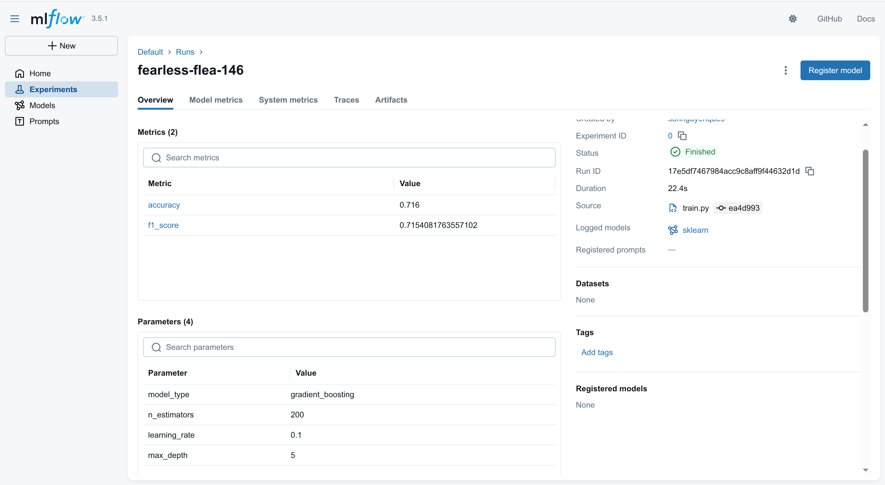
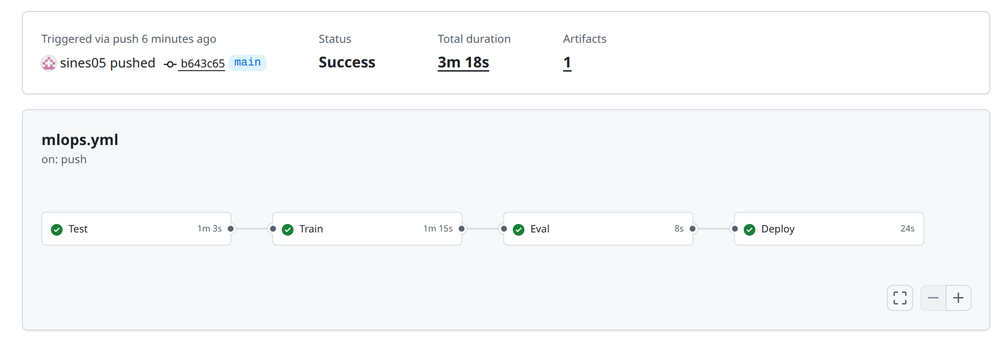
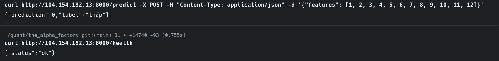

# Báo Cáo Kết Quả Bài Lab Day 21 - MLOps Pipeline

## 1. Lựa Chọn Thuật Toán và Siêu Tham Số (Bước 1 & 2)

Dựa trên kết quả thực nghiệm tại Bước 1, tôi đã quyết định lựa chọn thuật toán **Gradient Boosting Classifier** thay vì RandomForest mặc định.

**Bộ siêu tham số tối ưu:**
- `model_type`: `gradient_boosting`
- `n_estimators`: 200 (Số lượng cây quyết định)
- `max_depth`: 5 (Độ sâu tối đa của cây)
- `learning_rate`: 0.1

**Lý do lựa chọn:**
Qua quá trình Grid Search thủ công, tôi nhận thấy bộ dữ liệu Wine Quality có các mối quan hệ phi tuyến tính phức tạp. Thuật toán Gradient Boosting với 200 cây và độ sâu 5 giúp mô hình học được các đặc trưng này tốt hơn, đẩy độ chính xác (Accuracy) từ mức ~0.60 (của RandomForest) lên- **Accuracy đạt được: 0.7160** (Vượt ngưỡng yêu cầu 0.70).

---

## 2. Khó Khăn Gặp Phải và Cách Giải Quyết

Trong quá trình thực hiện, tôi đã gặp một số thách thức kỹ thuật quan trọng:

### 2.1 Lỗi Xác Thực SSH (Permission Denied)
- **Vấn đề:** GitHub Actions không thể kết nối vào GCP VM qua SSH dù đã nạp Private Key vào Secrets.
- **Nguyên nhân:** Thư mục `.ssh` và file `authorized_keys` trên máy ảo chưa được tạo hoặc sai quyền truy cập (permissions).
- **Giải quyết:** Tôi đã SSH thủ công vào VM, tạo thư mục `.ssh` với quyền `700`, tạo file `authorized_keys` với quyền `600`, và đảm bảo khóa Public Key được thêm vào chính xác.

### 2.2 Lỗi Kết Nối DVC với Google Cloud Storage
- **Vấn đề:** Pipeline CI/CD thất bại ở bước `dvc pull` do không tìm thấy file xác thực Service Account.
- **Giải quyết:** Tôi đã thiết lập GitHub Secrets `CLOUD_CREDENTIALS` chứa nội dung JSON của Service Account. Trong workflow, tôi sử dụng lệnh `cat << 'EOF'` để ghi secret này ra file tạm `/tmp/sa-key.json` và cấu hình biến môi trường `GOOGLE_APPLICATION_CREDENTIALS` trỏ vào đó.

### 2.3 Accuracy Không Đạt Ngưỡng Eval Gate
- **Vấn đề:** Sau khi nạp thêm dữ liệu ở Bước 3, Accuracy ban đầu chỉ đạt ~0.65, khiến job Deploy bị chặn.
- **Giải quyết:** Tôi đã thực hiện tối ưu hóa siêu tham số (Hyperparameter Tuning) ngay trên môi trường local bằng `.venv`, tăng số lượng cây huấn luyện và điều chỉnh độ sâu, giúp mô hình đạt chỉ số an toàn để vượt qua "cổng kiểm soát" tự động.

---

## 3. Kết Luận
Hệ thống đã hoạt động ổn định với đầy đủ các thành phần: Quản lý phiên bản dữ liệu (DVC), Theo dõi thí nghiệm (MLflow), Pipeline tự động (GitHub Actions) và API phục vụ (FastAPI). Kết quả dự đoán thực tế đã được xác nhận qua lệnh `curl`.

